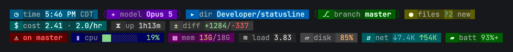

<h1 align="center">statusline</h1>

<p align="center">
  <b>Design your terminal status line in a browser. Ship it to Claude Code and tmux.</b><br>
  One layout engine, three render targets — so the preview can't lie to you.
</p>

<p align="center">
  <b><a href="https://statusline.xyz">statusline.xyz</a></b> ·
  <a href="https://statusline.xyz/app">Open the builder</a> ·
  <a href="https://statusline.xyz/docs">Docs</a>
</p>

<p align="center">
  <a href="#quick-start">Quick start</a> ·
  <a href="#the-tiles">68 tiles</a> ·
  <a href="#make-it-react">Rules</a> ·
  <a href="#cli-reference">CLI</a> ·
  <a href="docs/REFERENCE.md">Docs</a>
</p>

<p align="center">
  
  
  
  
</p>

<p align="center">
  
</p>

<p align="center"><sub>Real output from <code>statusline render</code> — not a mockup.</sub></p>

---

## Why

A status line is one row of text with no scroll and no second chance. Getting it
right means you stop typing `git status` forty times a day, because the answer
was already on screen.

Most people write a shell script, fight escape codes for an hour, and settle.
This replaces that hour with a drawing sheet — drag tiles, set what survives when
the terminal narrows, export one config.

## Quick start

```bash
git clone https://github.com/Bravim-Ketan-Purohit/statusline
cd statusline
pnpm install && pnpm build

# see it render right now
echo '{"model":{"display_name":"Opus 5"},"workspace":{"current_dir":"'$PWD'"}}' \
  | COLUMNS=140 node packages/cli/dist/statusline.js render

# open the visual builder
pnpm --filter @statusline/web dev      # → http://localhost:4321
```

Design a bar, hit **Copy install**, paste the command. It writes
`~/.config/statusline/config.json` and patches `~/.claude/settings.json` —
showing you a diff first, never overwriting blindly.

For tmux:

```bash
node packages/cli/dist/statusline.js tmux-conf >> ~/.tmux.conf
```

## One engine, three targets

The browser preview and the row in your terminal run the **same** width math,
the same layout solver and the same drop decisions. Only the final adapter
differs.

| | Claude Code | tmux | Web |
|---|---|---|---|
| Transport | stdout, JSON on stdin | `#()` in the status format | DOM |
| Rows | up to 5 | 1 | unlimited |
| Refresh floor | 1 s | `status-interval` | 60 fps |
| Click a tile | opens an OSC 8 link | runs a real command | DOM events |

The builder shows a per-target capability readout, so you find out about a
limit while designing rather than after installing.

## The tiles

**68 of them**, each declaring what it costs to compute — because nothing
expensive may run on the render path:

| Tier | Meaning |
|---|---|
| **T0** | free, already in the JSON on stdin |
| **T1** | a local file read |
| **T2** | a subprocess, cached |
| **T3** | sampled by the background daemon |
| **T4** | network, needs a credential |

<details>
<summary><b>The full catalogue</b></summary>

**Session (22)** — `model` `effort` `session-name` `session-duration` `cost`
`context-bar` `context-pct` `five-hour-bar` `seven-day` `lines-changed`
`cc-version` `vim-mode` `agent` `linear-assigned` `linear-started`
`linear-review` `linear-triage` `sentry-issues` `sentry-events`
`deploy-status` `deploy-duration` `deploy-url`

**Git (14)** — `git-branch` `git-counts` `git-ahead-behind` `git-last-commit`
`git-stash` `git-sha` `git-diff` `worktree` `repo-slug` `pr`
`protected-branch` `ci` `gh-pr-counts` `gh-issues`

**Environment (18)** — `clock` `cwd` `venv` `node-version` `python-version`
`hostname` `battery` `kube-context` `aws-profile` `gcp-project` `cpu`
`memory` `swap` `disk` `load` `network` `gpu` `vram`

**Personal (3)** — `verse` `track` `skills`

**Media (6)** — `now-playing` `media-play` `media-prev` `media-next`
`media-vol-up` `media-vol-down`

**Layout (5)** — `text` `spacer` `separator` `command` `fill-band`

</details>

Run `statusline tiles` for the live list.

## It gets out of the way when the terminal shrinks

Every tile carries a **priority**. When the row won't fit, whole tiles drop by
rank — never a wrap, never a truncation mid-tile.

```
200 cols   ⎇ branch master   ▸ dir Developer/statusline   ✦ model Opus 5   ◷ time 5:46 PM   ▮ cpu ██░░░░░░ 19% …
100 cols   ⎇ branch master   ▸ dir Developer/statusline   ✦ model Opus 5   ◷ time 5:46 PM
 64 cols   ⎇ master   ▸ statusline   ✦ Opus 5   ◷ 5:46 PM   ▮ 19%
```

At 64 columns compact mode drops the labels and shortens the values. Six
breakpoints, sparse inheritance, overridable per tile.

## Make it react

**26 signals** — CI failing, memory spiking, a review requested, a protected
branch checked out — bound to a colour, a border, a blink, or a rule that hides
the tile entirely until it has something to say.

```jsonc
{
  "signal": "ci.failing",
  "border": { "edge": "thin", "color": "#ff5f5f" },
  "blink":  { "target": "border", "color": "#ff5f5f", "hz": 2 },
  "bell":   true          // rings once when the incident starts, not every render
}
```

Blink is derived from the clock rather than the terminal's blink attribute, so
it looks the same everywhere and doesn't depend on a setting your emulator may
quietly ignore.

## Make it yours

**15 fill modes** — `linear` `radial` `conic` `diamond` `wave` `ripple`
`spiral` `barber` `comet` `scan` `plasma` `pulse` `breathe` `rainbow` `strobe`
— with multi-stop ramps, flowing phase, and image import.

Your terminal has no gradients: it has cells and escape codes. Every fill is
quantised to the 216-colour cube and emitted one `SGR` per cell, and the
builder shows you that quantised result while you design — not the smooth
version you'll never actually see.

## CLI reference

```
render         read Claude Code's stdin JSON, print the status line
tmux           print a tmux format string for status-left/right
tmux-conf      print the .tmux.conf snippet, mouse binding included
tiles          list every available tile
doctor         report what's misconfigured, and how to fix it
daemon         loopback listener + metric sampler
import/export  move a config between machines
approve        review and approve the config's custom commands
creds          store API tokens in a 0600 file, never in the config
```

Full list: `statusline --help` · [docs/REFERENCE.md](docs/REFERENCE.md)

## It runs on every keystroke, so it behaves

- **Commands are argv arrays, never shell strings.** Nothing in a config can
  smuggle in a metacharacter.
- **An approval gate keyed to the exact arguments.** Configs travel as pasted
  blobs, so any command one wants to run must be approved — and editing the
  command revokes the approval.
- **Credentials must be `0600`** or they're refused, and they live in their own
  file, never in the config you paste into a chat.
- **The daemon binds to 127.0.0.1** behind a token with a fixed allowlist.
- **Zero network calls on the render path.** The daemon samples; the renderer
  reads a cache.

## Architecture

```
packages/
  core/   schema (zod) · width math · layout solver · 68 tiles · fills · rules
          adapters: ansi · tmux · web
  cli/    render · tmux · daemon · doctor · import/export · creds · registry
  web/    the drawing-sheet builder — imports core, previews through it
```

`core` is pure: `(config, breakpoint, runtimeData) -> Span[]`. That purity is
what makes "the preview cannot drift" true rather than aspirational.

## Contributing

```bash
pnpm verify        # build + 135 tests + the perf gate
```

`pnpm bench` calibrates Node's startup cost on your machine, subtracts it, and
gates on what's left — the renderer's own cost, which is portable across
hardware. The build fails above 75 ms. A laptop lands around 40 ms with all 68
tiles resolved. See [CONTRIBUTING.md](CONTRIBUTING.md).

## Known limits

Stated plainly, because finding these out later is worse:

- Flowing fills are a **slow pulse** in Claude Code, not smooth animation — the
  refresh floor is one second. The web preview animates properly.
- A **GIF becomes a rotating palette**, not playback.
- A baked image is a **96×8 colour field**, not a photograph.
- **Metric tiles need `statusline daemon` running.** Without it they render
  nothing; `doctor` says so.
- Overline and coloured underlines want a modern terminal (Kitty, WezTerm,
  iTerm2, Ghostty). Elsewhere they're ignored, not garbled.
- Linear, Sentry and Vercel are **parsing-proven, not API-proven** — tested
  against fixtures, never yet pointed at the real endpoints.

## Licence

MIT — see [LICENSE](LICENSE).

<sub>Not affiliated with or endorsed by Anthropic. Claude Code is a product of Anthropic.</sub>
